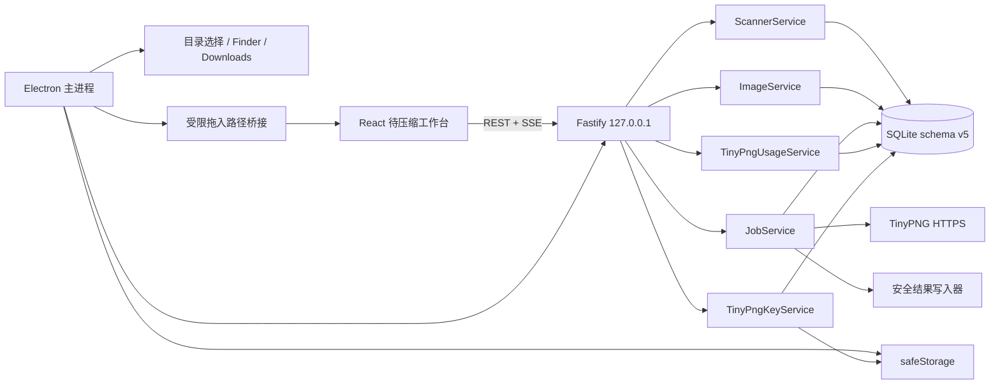
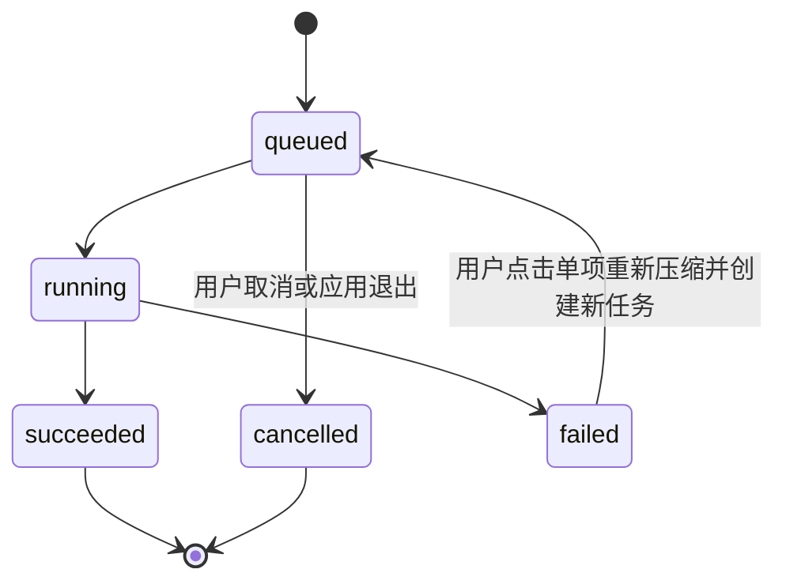

# 本地图片压缩管理工具技术架构

## 1. 文档信息

- 文档版本：v3.1
- 更新日期：2026-08-18
- 关联需求：[需求文档](./requirements.md)
- 当前架构：Electron 桌面应用 + Fastify 本机服务 + React 页面

## 2. 架构原则

- 待压缩列表是本次会话状态，不是原图目录的镜像。
- 原图来源按文件记录，可从多个目录加入；原图始终只读。
- 设置只保存默认结果目录、递归扫描、并发和冲突策略；TinyPNG Key 由独立 Key 服务管理。
- 每个新批次拥有独立输出根目录，失败项只允许用户显式重新提交。
- SQLite 与 REST 是权威状态，SSE 只发送“状态有变化”的通知。
- 自动化与打包默认离线，任何缺失缓存都应明确失败。

## 3. 运行结构



Electron 主进程负责单实例、窗口生命周期、系统目录选择、Downloads 路径、Finder 和加密密钥存储。渲染进程不启用 Node；preload 只暴露 `webUtils.getPathForFile()` 所需的单一能力。

Fastify 同时提供 API、SSE、缩略图/预览和生产静态页面。默认使用随机可用端口绑定 `127.0.0.1`，不监听局域网。

## 4. 会话模型

### 4.1 启动

启动时执行会话初始化事务：

1. 删除旧 `compression_jobs` 及级联的 `job_items`。
2. 删除旧 `scan_runs`。
3. 把全部 `image_entries.present` 设为 `0`。
4. 保留设置、加密 Key、额度缓存及已有压缩记录所需的底层数据。

因此页面初始待压缩列表和批次列表始终为空，不存在“恢复任务”分支。实现函数应使用“初始化新会话”的命名，避免把清空行为误解为任务恢复。

### 4.2 图片加入

拖入和目录扫描统一调用 `POST /api/scans`：

```ts
interface ScanRequest {
  paths: string[];
  recursive: boolean;
  sourceLabel?: string;
  mode?: "incremental" | "force_hash";
}
```

`ScannerService` 对输入路径做规范化和边界检查，遍历目录、过滤隐藏项与符号链接、读取元数据并计算源哈希。每张图片把真实绝对路径写入 `source_absolute_path`，列表显示通过 `present=1` 派生。

后续扫描采用追加语义。相同规范绝对路径生成稳定键并去重；不同目录的同名文件仍是不同项。`POST /api/scans/stop` 触发 `AbortController`，停止后不回滚已经入库的项。

`DELETE /api/images` 通过 `present=0` 从本次列表移除图片。存在 `queued` 或 `running` 任务的图片拒绝移除。

## 5. 设置与输出

`SettingsService.ensureDefaults()` 在首次运行时创建内部 `session-source` 占位目录，并把平台提供的 Downloads 路径设为默认输出目录。`sourceDir` 仅作为旧数据库结构和路径策略的内部兼容字段，不再暴露为用户设置。

用户可配置：

- 默认下载目录或自定义保存目录。
- 导入后是否自动压缩。
- 扫描是否递归。
- 压缩并发数。
- 输出冲突策略。
- 多个 TinyPNG API Key、当前 Key 及每个 Key 的独立额度。

`SessionOutputService` 管理当前应用会话的默认输出目录。自动模式下，第一次有效任务创建时在 Downloads 下独占创建 `图片压缩_YYYY-MM-DD_HH-mm-ss`，冲突时追加 `-2`、`-3`；本次会话后续手动和自动任务复用该目录。自定义模式直接使用用户目录。首个任务事务落库失败时，只删除仍为空且未被其他任务引用的会话目录。

每个 `compression_jobs.output_root_path` 固定记录批次根目录，每个 `job_items.output_relative_path` 固定记录该图片在批次内的路径。多来源重名由 `uniqueOutputPaths()` 添加数字后缀。失败项手动重压时复用原批次根目录，但创建新的任务记录。

每个 `compression_jobs` 同时保存创建时的 `tinypng_key_id` 和名称快照。切换当前 Key 不改变已有任务；失败项重压会创建新任务，因此绑定重试时的当前 Key。

`OutputWriter` 按输出根目录串行化最终文件名选择和原子提交，TinyPNG 网络请求仍按配置并发。这样多个单图自动任务写入同一目录时不会因“检查后重命名”的竞争窗口覆盖文件。

### 5.1 导入自动化

`ScannerService` 在支持的图片成功入库后发出 `{ scanId, imageId, newlyAdded }`。`ImportAutomationService` 先发布 `image.detected` 供页面默认选中，再读取识别时刻的设置；开关开启且图片状态严格为 `pending` 时，以 `auto:<scanId>:<imageId>` 为幂等键创建单图任务。

任务创建错误通过 SSE 返回页面，图片仍为待压缩且保持选中。导入自动化不监听目录，不补处理开关开启前已有图片，也不自动重试失败任务。

## 6. 任务状态机



任务项状态只允许 `queued`、`running`、`succeeded`、`failed`、`cancelled`、`skipped`。任务聚合状态只允许 `queued`、`running`、`completed`、`completed_with_errors`、`cancelled`。

`JobService.execute()` 对 TinyPNG 只调用一次，不包含退避或自动重试循环。失败写入错误码和消息后结束该项。`POST /api/job-items/:id/retry` 仅接受 `failed` 项，并由用户操作创建一个单项新任务。

额度服务在任务创建前和领取队列时按 Key 执行熔断。额度耗尽、Key 无效或密钥缺失时，只有相同 `tinypng_key_id` 的 `queued` 项批量写为 `failed`；其他 Key 继续调度，额度刷新不会重新入队。

关闭应用时，排队项标为取消，运行请求通过 `AbortController` 中止，随后关闭 Fastify、执行 WAL checkpoint 并关闭数据库。下次启动删除旧任务。

## 7. 数据与兼容性

SQLite schema v5 的关键表：

| 表 | 当前用途 |
| --- | --- |
| `workspaces` | 单个活动设置；旧 `source_*`、`watch_enabled`、`auto_compress` 仅为兼容字段 |
| `scan_runs` | 当前会话扫描进度和停止状态 |
| `image_entries` | 图片身份、绝对来源路径、元数据、哈希和 `present` |
| `compression_jobs` | 当前会话批次及独立输出根目录 |
| `job_items` | 批次内图片、状态、错误与输出相对路径 |
| `compression_records` | 结果校验、预览和源哈希关联 |
| `tinypng_api_keys` | Key 名称、当前 Key 和非敏感元数据 |
| `tinypng_api_usage` | 每个 Key 的额度快照与验证状态 |
| `api_usage` | 旧单 Key 额度迁移来源，v6 停止业务写入 |

旧数据库中的 `watch_enabled` 与 `auto_compress` 迁移后统一写为 `0`，业务契约不再读写这两个字段。新的 `autoCompressOnImport` 与 `outputMode` 保存在 `settings.json`，避免与旧目录监听语义混淆。数据库中不得产生 `paused`、`awaiting_resume` 或 `awaiting_quota` 状态。

## 8. 安全边界

- 修改类 API 需要 `x-local-app-token`，并校验请求来源。
- 所有源文件使用 `lstat`/`realpath` 校验，不跟随符号链接。
- 输出路径通过统一路径策略限制在批次根目录内。
- 输出先写入随机临时文件，校验长度、类型和哈希后原子重命名。
- API Key 按服务端生成的 Key ID 分文件加密；完整值仅在主进程安全存储与后端调用期间存在，不进入 DTO、SQLite 或日志。
- Electron 页面只允许导航到本机运行时 origin；外部 HTTPS 链接交给系统浏览器。

## 9. 固定离线测试区

`.ica-test/` 是唯一受支持的测试运行区，按版本缓存：

- 经项目 `checksums.json` 验证的 Electron ZIP 解压结果。
- `better-sqlite3` 的 Node ABI 127 与 Electron ABI 148 绑定。
- npm 与 node-gyp 的受限构建缓存；Node 头文件只读取当前 Node 安装目录。
- 固定图片 fixture。
- Web、桌面和打包冒烟各自隔离的应用数据与报告。

`scripts/test/prepare.mjs` 只搜索本机 Electron 缓存，不执行下载。Node ABI 直接通过已安装的 `node-gyp` 和当前 Node 头文件构建，绕过 `prebuild-install`；Electron ABI 缓存缺失时立即停止。所有子命令设置 `npm_config_offline=true`。运行单测和 Web E2E 前切到 Node ABI；运行 Electron 或打包前切到 Electron ABI；`finally` 必须恢复 Node ABI。打包器使用 `npmRebuild=false`，只接受切换完成的本地原生模块。

验证分层：

1. `pnpm test:doctor`：缓存、SHA-256、清单、ABI、活动测试进程。
2. `pnpm typecheck` 与 `pnpm lint`：静态验证。
3. `pnpm test`：服务单元与集成测试，TinyPNG 使用本地假适配器。
4. `pnpm build`：Web、server 和 desktop 生产构建。
5. `pnpm test:e2e`：浏览器完整流程，数据写入 `.ica-test/runs/web`。
6. `pnpm test:desktop`：使用解压后的 Electron 绝对路径进行人工桌面验证。
7. `pnpm test:package`：离线打包并启动解压后的真实 `.app` 做冒烟验证。

桌面和真实 `.app` 会启动 GUI，应由用户明确执行或批准。缓存缺失、ABI 不匹配或 ZIP 哈希错误时立即失败，不能以联网下载作为测试步骤。

## 10. 分发约束

- 只生成 `darwin-arm64` ZIP，不生成 Intel、universal、DMG 或安装器。
- Electron 版本必须与本机缓存 ZIP 精确匹配。
- `better-sqlite3` 和 `sharp` 以 arm64 原生模块随应用打包。
- 使用 Ad Hoc 签名，不执行 Developer ID 签名、公证或自动更新。
- 打包结束和测试异常后都必须恢复工作区中的 Node ABI。
