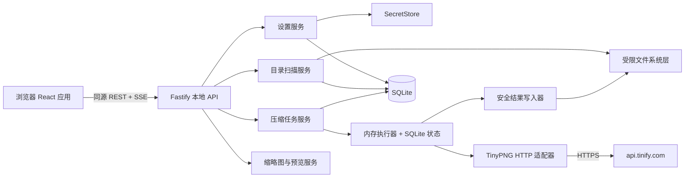
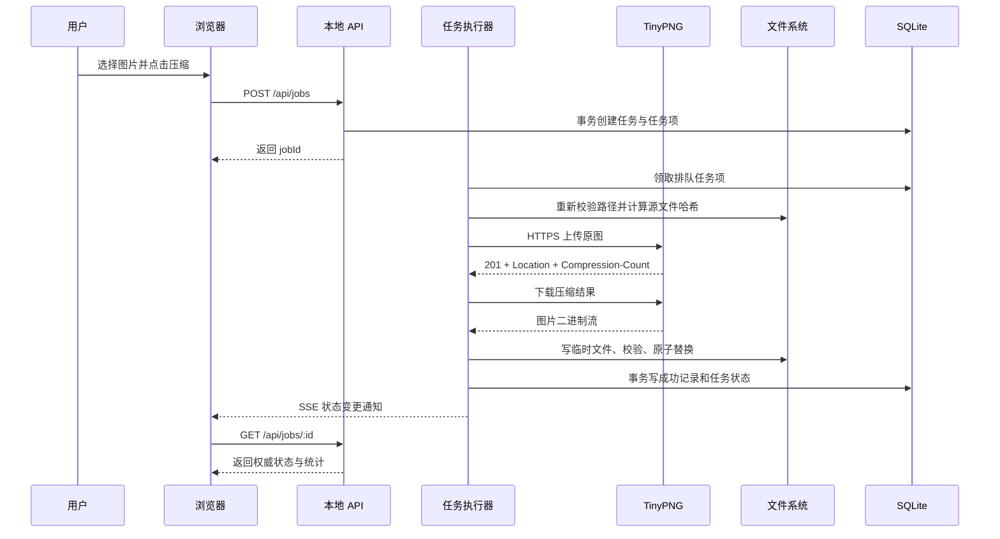
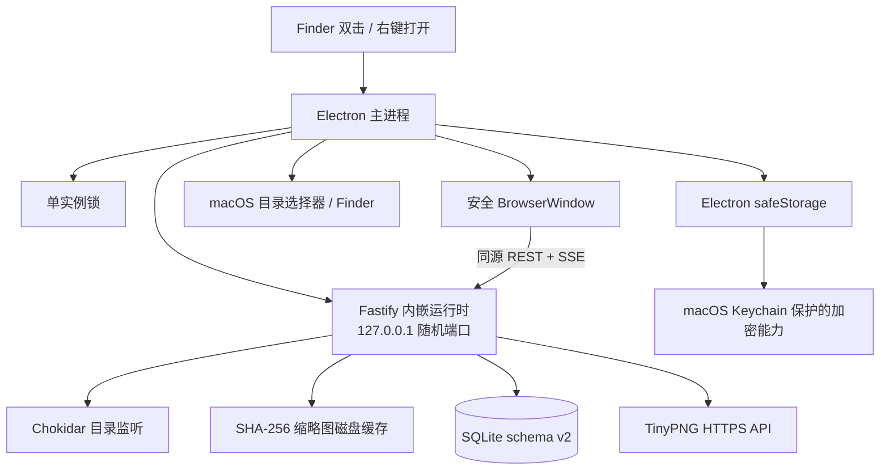
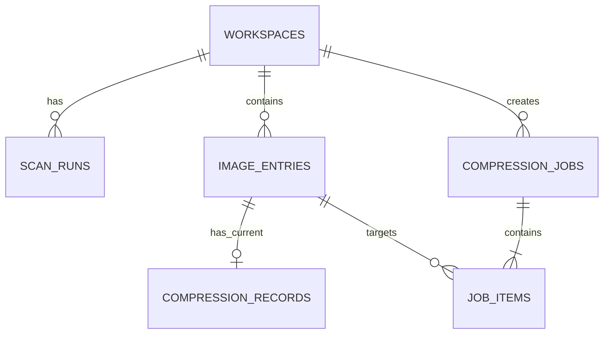
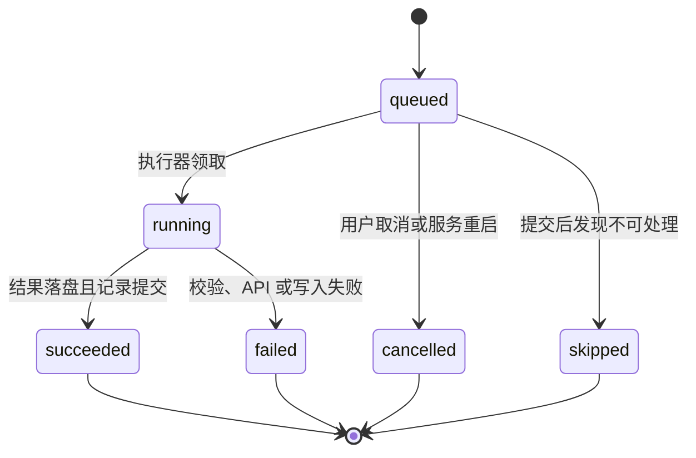

# 本地图片压缩管理工具技术实现架构文档

## 1. 文档信息

- 项目名称：本地图片压缩管理工具
- 文档版本：v2.0
- 文档日期：2026-08-13
- 关联需求：[需求文档](./requirements.md)
- 目标版本：第二版 / P1
- 首要运行平台：macOS
- 运行形态：Electron 桌面应用 + 内嵌本机服务

本文档把产品需求转化为可以直接实施的技术方案。P0 内容为继承的首版基础；原 P1 功能已纳入第二版交付。若旧章节仍以未来时态描述 P1，以本节和第 4.4 节的第二版架构为准。

## 2. 目标与约束

### 2.1 架构目标

- 用户可在浏览器中配置原图目录、结果目录和 TinyPNG API Key。
- 浏览器只负责展示和发起操作，不直接获得任意本地文件访问能力。
- 本机服务负责扫描目录、读取图片、调用 TinyPNG、保存结果和维护记录。
- 原图始终只读；任何失败都不能留下被误认为成功的结果文件。
- 能准确识别待压缩、已压缩、原图已更新、结果缺失和压缩失败等状态。
- 批量任务部分失败时，其余图片继续处理。
- API Key 不返回浏览器、不写入日志、不进入版本库。
- 所有依赖外部服务和文件系统的逻辑都有可替换边界，自动化测试不消耗真实 TinyPNG 额度。

### 2.2 已知约束

- 普通网页无法持续、无提示地扫描和写入用户任意指定的本地目录，因此必须运行本机后端。
- TinyPNG 压缩需要把原图上传到第三方服务 `api.tinify.com`。
- TinyPNG 压缩次数属于外部计费资源，重试、并发和重复提交必须受控。
- 首版优先支持 macOS，但路径和核心领域代码不得依赖 macOS 专属分隔符。
- 首版不实现图片格式转换、缩放、裁剪、元数据保留或云端存储。

## 3. 功能分档

### 3.1 P0：MVP 必须完成

- 本地服务启动、健康检查、浏览器访问和仅本机监听。
- 浏览器设置页：原图目录、结果目录、递归扫描、并发数、API Key。
- API Key 的填写、显示本次输入、测试、保存、更换、删除和脱敏状态。
- 目录校验、目录扫描、图片元数据、缩略图、分页、搜索、筛选和排序。
- 单张、多选和“全部待压缩”任务。
- TinyPNG API 调用、有限重试、额度数读取和错误分类。
- 结果目录保持源相对路径、临时文件写入和原子替换。
- SQLite 持久化、状态恢复、原图指纹和结果存在性校验。
- 批次进度、结果汇总、失败重试和取消尚未开始的项目。
- 路径越界、符号链接、输出冲突、CSRF、密钥和日志保护。
- 单元、集成和端到端自动化测试。

### 3.2 P1：第二版已实现

- 自动监听原图目录并增量刷新。
- 原图与压缩结果并排或滑块质量对比。
- 用 macOS Keychain 替换权限受限的本地密钥文件。
- 原生目录选择器和“在 Finder 中显示”。
- 打包为可双击启动的桌面应用。
- 暂停任务、断点续跑和更完整的任务历史页面。
- 输出冲突策略可配置为覆盖、跳过或增加后缀。
- 虚拟列表和缩略图磁盘缓存的进一步性能优化。

### 3.3 P2：后续扩展

- Windows 与 Linux 的完整安装、凭据存储和文件管理器集成。
- 多工作区同时管理。
- 多种压缩服务适配器或纯本地压缩引擎。
- 自动化规则、定时任务和无人值守压缩。
- 多版本结果、质量参数、格式转换和图片变换。
- 局域网访问、多用户和权限系统。

P1/P2 不应提前改变 P0 的数据安全规则和模块边界。

### 3.4 第二版分发约束

- Electron 构建只输出 darwin-arm64 ZIP；不构建 Intel 或 universal 包。
- arm64 打包脚本按已安装 Electron 的精确版本直接读取 `~/Library/Caches/electron/` 中的 ZIP，使用 `electronDist` 进入离线构建；不请求镜像或在线校验文件，缓存缺失时立即失败。
- `electron-builder` 设置 `identity: "-"` 和 `hardenedRuntime: false`，对最终应用及嵌套组件执行 Ad Hoc 签名，但不执行 Developer ID 签名和公证。
- 应用、Web 静态资源、Fastify 运行时、SQLite 和 Sharp 原生模块一并打包，目标机器不依赖开发环境。
- 发布者不内置 API Key。密钥和数据库只写入当前使用者的 macOS 用户数据目录。
- 首次启动采用 Finder 右键“打开”或“系统设置 → 隐私与安全性 → 仍要打开”的系统批准流程；目标 Mac 的安全策略可能禁止未公证应用，不提供 `xattr`、关闭 Gatekeeper 等绕过方法。
- 不配置 App Store、DMG、安装器、更新服务器或 `autoUpdater`。

## 4. 总体架构

### 4.1 逻辑架构



### 4.2 部署架构

P0 生产运行时只有一个 Node.js 进程：

1. Fastify 提供 `/api/*`、缩略图、预览和 SSE。
2. Fastify 同时提供 Vite 构建后的静态前端资源。
3. 扫描协调器和任务执行器运行在同一进程内。
4. SQLite、设置、日志和密钥保存到用户级应用数据目录。
5. 服务默认绑定随机可用端口上的 `127.0.0.1`，绝不默认绑定 `0.0.0.0`。

开发环境允许两个进程：Vite 开发服务通过代理访问 Fastify；这只是开发便利，前后端契约与生产环境保持一致。

### 4.3 核心数据流



SSE 只负责通知“有状态变化”，SQLite 与 REST 返回值才是权威状态。SSE 断线后，页面重新查询当前扫描和任务即可恢复。

### 4.4 第二版桌面运行架构



主进程先取得单实例锁，再启动内嵌服务，最后把窗口导航到随机本机地址。渲染进程设置 `nodeIntegration: false`、`contextIsolation: true`、`sandbox: true`，不直接访问 Node.js 或任意本地文件。目录选择、Finder 操作和安全存储通过后端的平台能力接口完成。

退出流程由同一个幂等 `shutdown()` 协调：停止新任务、停止监听、等待扫描和任务执行器关闭、关闭 Fastify、执行 SQLite WAL checkpoint、关闭数据库，最后退出 Electron。页面退出按钮与窗口关闭均进入此流程。

### 4.5 监听与任务恢复

目录监听只订阅当前有效原图根目录，并对事件进行防抖和路径边界校验。普通监听事件触发增量扫描；只有 `autoCompress=true` 时，新增文件才自动创建任务，修改既有文件不会未经确认消耗 API 次数。

重启恢复规则：

- `running` 项标记失败并记录 `APP_RESTARTED`，不自动重传。
- `queued` 与 `paused` 项转为 `awaiting_resume`。
- 用户点击继续后才把等待项重新放回队列。
- 已成功记录继续通过源哈希和结果存在性派生为“已压缩”。

### 4.6 原生模块与 arm64 构建

Electron 主进程与服务代码由 tsup 生成 ESM；`better-sqlite3` 和 `sharp` 保持为外部原生依赖，由 electron-builder 针对 arm64 重建。产物必须检查 Electron 可执行文件及所有 `.node` 文件均为 arm64。

## 5. 技术栈决策

### 5.1 运行时与工程

| 类别 | P0 决策 | 原因 |
| --- | --- | --- |
| Node.js | Node.js 22 或更高 LTS 版本 | 支持现代 TypeScript 工具链和稳定的 Web API；部署前锁定实际 LTS 版本 |
| 语言 | TypeScript，开启严格模式 | 前后端共享契约，减少状态与路径处理错误 |
| 包管理 | pnpm workspace | 单仓库管理前端、后端和共享包 |
| 构建 | Vite + tsup 或 `tsc` | Vite 构建前端，后端输出 Node.js 代码 |
| 代码规范 | ESLint + Prettier | 统一格式和静态检查 |

### 5.2 前端

| 类别 | P0 决策 | 原因 |
| --- | --- | --- |
| UI | React + TypeScript | 适合状态密集的本地管理界面 |
| 路由 | React Router | 主列表与设置页边界清楚 |
| 服务端状态 | TanStack Query | 缓存、轮询回退、失效刷新和请求状态成熟 |
| 表单 | React Hook Form + Zod | 设置校验与 API Schema 可共享 |
| 图标 | Lucide React | 使用一致的通用图标 |
| 样式 | CSS Modules + CSS 变量 | 依赖轻，容易构建紧凑工具界面 |

不引入大型全套 UI 框架。页面以表格、工具栏、状态标签、设置表单和模态框为主。

### 5.3 后端

| 类别 | P0 决策 | 原因 |
| --- | --- | --- |
| HTTP 服务 | Fastify | Schema、日志、插件和测试注入能力适合本地 API |
| API Schema | TypeBox 或 Zod，选定一种全项目统一 | 运行时校验并生成 TypeScript 类型 |
| 数据库 | SQLite + `better-sqlite3` | 单用户本地应用可靠、部署简单、支持事务 |
| 图片元数据 | Sharp | 支持目标格式的尺寸、类型和缩略图处理 |
| 日志 | Fastify/Pino | 结构化日志并支持字段脱敏 |
| ID | UUID v7 或 ULID | 可排序、不暴露文件路径 |

SQLite 操作量小且以短事务为主，`better-sqlite3` 的同步调用可接受。哈希、缩略图和图片解码不得放在数据库事务中。

### 5.4 TinyPNG 客户端

P0 使用项目自有的 `TinyPngAdapter` 对接官方 HTTP API，而不是让业务层直接调用官方 Node.js SDK。

原因：

- 官方 Node.js SDK 的默认导出使用可变的全局 Key；用户在页面测试新 Key 时可能与后台任务并发，容易产生凭据串用。
- 原始 HTTP API 可明确控制上传、结果下载、超时、重试、响应头和流式写入。
- 测试时可注入本地假服务，完全避免真实额度消耗。
- 业务层仍只依赖接口，未来可换成官方 SDK 实现。

官方协议依据：

- 服务地址固定为 `https://api.tinify.com`。
- 使用 HTTP Basic Auth，用户名固定为 `api`，密码为 API Key。
- 上传使用 `POST /shrink`，请求体为图片二进制。
- 成功上传返回 `201` 和 `Location` 结果地址。
- 结果通过 `GET Location` 下载。
- `Compression-Count` 响应头表示当月已用压缩次数。
- 当前压缩输入支持 AVIF、WebP、JPEG 和 PNG。

参考：[TinyPNG HTTP API](https://tinify.com/developers/reference/http) 和 [TinyPNG Node.js API](https://tinify.com/developers/reference/nodejs)。实施时锁定依赖和协议前应再次核对官方文档。

## 6. 代码组织

建议目录：

```text
image-compression-automation/
├── apps/
│   ├── web/
│   │   └── src/
│   │       ├── app/
│   │       ├── components/
│   │       ├── features/images/
│   │       ├── features/jobs/
│   │       ├── features/settings/
│   │       ├── lib/api/
│   │       └── styles/
│   └── server/
│       └── src/
│           ├── api/
│           ├── application/
│           ├── domain/
│           ├── infrastructure/
│           │   ├── database/
│           │   ├── filesystem/
│           │   ├── secrets/
│           │   └── tinypng/
│           ├── bootstrap/
│           └── index.ts
├── packages/
│   ├── contracts/
│   └── test-support/
├── docs/
├── migrations/
├── package.json
├── pnpm-workspace.yaml
└── tsconfig.base.json
```

模块依赖方向必须保持：

```text
api -> application -> domain
                     ^
infrastructure ------|
```

- `domain` 不导入 Fastify、SQLite、Sharp 或 TinyPNG。
- `application` 编排用例并依赖抽象端口。
- `infrastructure` 实现数据库、文件系统、密钥和 TinyPNG 端口。
- `api` 只做身份校验、输入验证、DTO 转换和调用应用用例。
- 前后端只通过 `packages/contracts` 共享 DTO 与枚举，不共享数据库实体。

## 7. 后端模块设计

### 7.1 ConfigService

职责：

- 读取和保存非敏感设置。
- 校验原图目录、结果目录、递归设置和并发数。
- 创建不存在的结果目录前返回明确的确认需求。
- 保存当前活动工作区，并在目录改变时触发重新扫描。

非敏感设置保存在应用数据目录的 `settings.json`，使用“临时文件 + `fsync` + 重命名”原子写入。JSON 中不得出现 API Key。

设置保存跨越 `settings.json` 和 `SecretStore`，不具备单个数据库事务。保存流程必须：先完成目录、Key 和全部字段的无副作用校验；再暂存新的设置文件和密钥文件；最后在一个受互斥锁保护的提交阶段依次替换。任一步骤失败时恢复旧文件，并重新读取最终状态返回页面。提交期间压缩任务继续使用领取时的配置快照，新任务等待提交完成，防止同时读到新旧混合配置。

### 7.2 SecretStore

接口：

```ts
interface SecretStore {
  hasTinyPngKey(): Promise<boolean>;
  getTinyPngKey(): Promise<string | null>;
  setTinyPngKey(value: string): Promise<void>;
  deleteTinyPngKey(): Promise<void>;
}
```

P0 固定实现：

- 密钥保存在应用数据目录的独立文件中，而不是 `settings.json` 或 SQLite。
- 密钥目录权限为 `0700`，文件权限为 `0600`。
- 使用随机临时文件、`0600` 权限、完整写入和原子重命名。
- 启动时若权限比预期宽松，服务拒绝读取并提示用户修复或重新保存。
- API 返回值只包含 `configured: boolean`、验证状态、验证时间和额度数。
- 前端输入框只保存组件内的本次输入，不写入 `localStorage`、`sessionStorage`、URL 或遥测。

P1 将同一接口替换为 macOS Keychain 实现。之所以 P0 使用权限受限文件，是为了避免引入维护状态不明确的原生凭据依赖；接口边界确保替换不会影响页面和业务逻辑。

### 7.3 PathPolicy

所有本地路径操作必须经过唯一的 `PathPolicy`，禁止各模块自行拼接后直接读写。

核心能力：

```ts
interface PathPolicy {
  validateRoots(sourceDir: string, outputDir: string): Promise<ValidatedRoots>;
  resolveSource(relativePath: string): Promise<SafeSourcePath>;
  resolveOutput(relativePath: string): Promise<SafeOutputPath>;
  assertReadableSource(path: SafeSourcePath): Promise<void>;
  assertWritableOutput(path: SafeOutputPath): Promise<void>;
}
```

规则：

1. 配置时把根目录转为绝对路径并调用 `realpath` 得到规范路径。结果目录不存在时，必须先向用户返回“需要创建”，收到明确确认并安全创建后再调用 `realpath`。
2. 原图和结果目录不能相同，也不能互为祖先或后代。
3. 相对路径必须是规范化的相对路径，不允许绝对路径、空字节或 `..` 越界。
4. 使用 `path.relative(root, candidate)` 校验候选路径仍在根目录内。
5. 扫描时跳过所有符号链接，包括符号链接文件和目录。
6. 输出时逐段检查已有路径组件，不允许符号链接把写入位置引向目录外。
7. 文件系统访问使用服务端生成的图片 ID 查数据库，再解析路径；API 不接受任意绝对文件路径作为图片标识。
8. macOS 首版使用 NFC 规范化加不区分大小写的路径冲突键，宁可保守拒绝，也不静默覆盖两个逻辑上不同的源文件。

### 7.4 ScannerService

扫描采用“单任务 + 受控文件并发”的后台流程：

1. 获取当前工作区快照并创建 `scan_run`。
2. 使用异步目录迭代递归遍历，跳过隐藏项、符号链接和不支持扩展名。
3. 对候选文件执行 `lstat`，记录大小、纳秒级修改时间和文件标识信息。
4. 若大小与修改时间和上次一致，复用原 SHA-256；否则以流方式重新计算。
5. 使用 Sharp 读取真实格式、尺寸和基本元数据；真实格式不受支持时标记为不支持。
6. 批量 UPSERT `image_entries`，每批建议 50 至 100 条，事务保持短小。
7. 校验已有结果是否存在、类型是否为普通文件、大小是否符合记录。
8. 本轮未见到的旧记录标记为 `source_missing`，默认不在主列表展示，但保留历史记录。
9. 完成 `scan_run` 并广播列表失效事件。

并发策略：

- 目录读取单路进行，避免一次打开大量目录句柄。
- 哈希和元数据读取并发默认为 4，上限 8。
- 同一时刻只允许一个扫描运行；重复请求返回当前 `scanId`，不叠加扫描。
- 压缩运行时可以扫描，但扫描遇到 `queued/running` 图片只更新源元数据，不覆盖任务状态。

性能与准确性权衡：

- 首次扫描必须为所有支持图片计算 SHA-256。
- 后续扫描在大小和修改时间未变时复用哈希。
- 压缩任务实际上传前必须再次计算 SHA-256，并与任务提交时快照比较。
- 如果用户怀疑保留了大小和修改时间的外部修改，提供“强制重新扫描”入口，重新计算全部哈希。

### 7.5 ThumbnailService

- 缩略图由 Sharp 从原图按需生成，最长边默认 256 像素。
- 保持宽高比，不放大较小图片，不携带原图元数据。
- 返回 WebP 或 JPEG，透明图优先 WebP。
- P0 使用小型内存 LRU 缓存，缓存键为 `imageId + sourceHash + size`。
- 响应带 `ETag` 和长期私有缓存头；源哈希变化后 URL 查询版本或 ETag 自动失效。
- 预览接口按图片 ID 和 `variant=source|output` 获取，响应设置正确 MIME、`nosniff` 和私有缓存头。
- 预览接口不把 API Key、任意路径读取能力或目录列表暴露给浏览器。

### 7.6 TinyPngAdapter

接口：

```ts
interface TinyPngAdapter {
  validateKey(key: SecretString, signal?: AbortSignal): Promise<KeyValidationResult>;
  compress(input: Readable, key: SecretString, options: CompressOptions): Promise<CompressResult>;
}
```

实现约束：

- 基础 URL 在生产构建中固定为 `https://api.tinify.com`，不得由浏览器输入。
- 仅测试构建允许依赖注入本地假服务地址。
- 使用 HTTP Basic Auth，但授权头禁止进入日志或错误对象序列化结果。
- 上传和下载使用流，不把整张图片同时复制多份到内存。
- 连接、响应头、上传和下载分别设置超时，总请求必须有最终上限。
- 校验 `Location` 必须为 HTTPS 且主机名为 `api.tinify.com`，防止异常响应导致任意地址请求。
- 读取并持久化 `Compression-Count`；缺失时不视为任务失败。
- 校验输出 `Content-Type` 与输入格式一致，P0 不接受格式转换。
- 校验输出字节数大于 0，且实际写入大小与 `Content-Length` 一致（响应提供时）。

API Key 验证：

- 参考官方 Node.js 客户端的 `validate()` 语义，向 `/shrink` 发送空的验证请求。
- 无效请求体导致的预期客户端错误表示凭据已通过认证；401/403、账户限制、连接和服务错误分别映射到明确结果。
- 测试新 Key 与保存新 Key是两个操作；验证通过不自动覆盖已有 Key。
- 验证实现应有契约测试，并在上线前用真实测试账户人工复核。

### 7.7 CompressionJobService

职责：

- 校验任务输入、图片状态和强制重复压缩确认。
- 在一个 SQLite 事务中创建批次与任务项。
- 使用 `clientRequestId` 保证浏览器重复提交不会创建重复批次。
- 同一图片只能存在一个 `queued` 或 `running` 任务项。
- 汇总任务状态、成功数、失败数、跳过数和字节统计。
- 取消尚未领取的任务项，运行中的 TinyPNG 请求 P0 不主动中断。

### 7.8 JobExecutor

任务执行器是单进程、受控并发的内存调度器，SQLite 保存权威任务状态。

领取规则：

1. 每个并发槽从数据库选择最早的 `queued` 项。
2. 用事务将其从 `queued` 改为 `running`，防止重复领取。
3. 读取图片和工作区快照，不使用浏览器传入路径。
4. 重新校验源文件、格式、大小和 SHA-256。
5. 如果源文件相对任务提交时发生变化，标记 `SOURCE_CHANGED_BEFORE_UPLOAD`，不消耗 API 次数。
6. 上传 TinyPNG、取得结果并交给 `OutputWriter`。
7. 结果完整落盘后，在事务中写压缩记录并把任务项改为 `succeeded`。
8. 失败时写入标准错误码和脱敏消息，然后处理下一项。

并发：

- 默认 2，上限 5，由设置控制。
- 设置变小只影响后续领取，不中断已运行项。
- 对同一 API 账户的请求共享限流器。
- 429 时暂停整个队列的后续领取一段退避时间，而不是让所有任务立即重试。

进程恢复：

- 浏览器刷新不影响任务，页面通过 REST 恢复。
- 服务进程意外退出后，启动恢复器将所有 `running` 项标记为 `failed / APP_RESTARTED`。
- 尚未开始的 `queued` 项标记为 `cancelled / APP_RESTARTED`，避免服务重启后未经用户确认继续消耗额度。
- 用户可以选择失败项重新提交。

### 7.9 OutputWriter

结果落盘步骤：

1. 通过 `PathPolicy` 得到受信任的目标路径。
2. 检查目标路径冲突。目标已存在但没有本工具对应成功记录时，返回 `OUTPUT_CONFLICT`。
3. 创建所需子目录并再次校验目录链无符号链接。
4. 在目标同目录创建随机临时文件，使用 `O_CREAT | O_EXCL`，权限建议 `0600`。
5. 将 TinyPNG 结果流写入临时文件，同时累计大小并可计算 SHA-256。
6. 刷新文件内容，关闭句柄，校验大小、MIME 和格式。
7. 对本工具管理的旧结果执行原子替换；macOS 使用同文件系统 `rename` 语义。
8. 刷新父目录并记录最终 `stat`。
9. 返回输出元数据，随后数据库才可标记成功。
10. 任一步骤失败都关闭句柄并清理本工具创建的临时文件。

不得直接让 TinyPNG 客户端写最终文件名。这样可确保网络中断或进程异常不会生成半成品成功文件。

### 7.10 EventService

SSE 地址：`GET /api/events`。

只发送不含密钥和文件二进制的轻量事件：

```json
{
  "type": "job-item.changed",
  "entityId": "01J...",
  "occurredAt": "2026-08-12T12:00:00.000Z"
}
```

事件用于触发 TanStack Query 失效刷新，不直接携带完整业务对象。支持心跳和自动重连；无法建立 SSE 时回退为 2 秒轮询活动任务、10 秒轮询扫描状态。

## 8. 数据模型

### 8.1 关系概览



P0 页面只允许一个活动工作区，但数据表保留 `workspace_id`，避免用户更换目录后同名文件误关联。

### 8.2 主要表

#### `workspaces`

| 字段 | 类型 | 说明 |
| --- | --- | --- |
| id | TEXT PK | ULID/UUID |
| source_dir | TEXT | 用户展示路径 |
| source_real_path | TEXT | 校验后的规范路径 |
| output_dir | TEXT | 用户展示路径 |
| output_real_path | TEXT | 校验后的规范路径 |
| recursive | INTEGER | 0/1 |
| compression_concurrency | INTEGER | 1 至 5 |
| active | INTEGER | P0 仅一个为 1 |
| created_at / updated_at | TEXT | ISO 8601 UTC |

#### `scan_runs`

| 字段 | 类型 | 说明 |
| --- | --- | --- |
| id | TEXT PK | 扫描 ID |
| workspace_id | TEXT FK | 所属工作区 |
| mode | TEXT | `incremental` / `force_hash` |
| status | TEXT | `running` / `succeeded` / `failed` |
| discovered_count | INTEGER | 已发现数量 |
| processed_count | INTEGER | 已处理数量 |
| warning_count | INTEGER | 警告数量 |
| error_code / error_message | TEXT NULL | 扫描级错误 |
| started_at / finished_at | TEXT | 时间 |

#### `image_entries`

| 字段 | 类型 | 说明 |
| --- | --- | --- |
| id | TEXT PK | 浏览器使用的图片 ID |
| workspace_id | TEXT FK | 工作区隔离 |
| relative_path | TEXT | 源相对路径 |
| relative_path_key | TEXT | 冲突检测规范键 |
| filename | TEXT | 文件名 |
| extension | TEXT | 小写扩展名 |
| mime_type | TEXT NULL | 实际类型 |
| width / height | INTEGER NULL | 像素尺寸 |
| source_size | INTEGER | 字节数 |
| source_mtime_ns | TEXT | 纳秒时间以文本保存，避免 JS 精度损失 |
| source_hash | TEXT NULL | SHA-256 十六进制 |
| supported | INTEGER | 是否受支持 |
| present | INTEGER | 本轮扫描是否仍存在 |
| last_seen_scan_id | TEXT | 最近扫描 |
| scan_error_code / scan_error_message | TEXT NULL | 单文件扫描错误 |
| created_at / updated_at | TEXT | 时间 |

唯一约束：`UNIQUE(workspace_id, relative_path_key)`。

#### `compression_records`

P0 每张图片只保留当前成功记录；任务历史由 `job_items` 保留。

| 字段 | 类型 | 说明 |
| --- | --- | --- |
| image_id | TEXT PK/FK | 一张图一条当前记录 |
| source_hash | TEXT | 成功时的源指纹 |
| source_size | INTEGER | 成功时源大小 |
| output_relative_path | TEXT | 输出相对路径 |
| output_size | INTEGER | 输出字节数 |
| output_hash | TEXT | 输出 SHA-256 |
| output_mtime_ns | TEXT | 写入后修改时间 |
| output_mime_type | TEXT | 结果类型 |
| compression_count | INTEGER NULL | API 当月次数 |
| compressed_at | TEXT | 成功时间 |

#### `compression_jobs`

| 字段 | 类型 | 说明 |
| --- | --- | --- |
| id | TEXT PK | 批次 ID |
| workspace_id | TEXT FK | 工作区 |
| client_request_id | TEXT | 幂等键 |
| status | TEXT | `queued/running/completed/completed_with_errors/cancelled` |
| total/succeeded/failed/cancelled/skipped | INTEGER | 汇总数量 |
| input_bytes/output_bytes | INTEGER | 汇总大小 |
| created_at/started_at/finished_at | TEXT | 时间 |

唯一约束：`UNIQUE(workspace_id, client_request_id)`。

#### `job_items`

| 字段 | 类型 | 说明 |
| --- | --- | --- |
| id | TEXT PK | 任务项 ID |
| job_id | TEXT FK | 批次 |
| image_id | TEXT FK | 图片 |
| status | TEXT | `queued/running/succeeded/failed/cancelled/skipped` |
| submitted_source_hash | TEXT | 提交时源指纹快照 |
| attempt_count | INTEGER | 外部请求尝试次数 |
| input_size/output_size/saved_bytes | INTEGER NULL | 统计 |
| error_code/error_message | TEXT NULL | 标准错误 |
| queued_at/started_at/finished_at | TEXT | 时间 |

创建部分唯一索引，禁止同一 `image_id` 同时存在 `queued` 或 `running` 项。

#### `api_usage`

保存最近一次成功响应中的 `compression_count`、更新时间和最近验证结果，不保存 API Key。

### 8.3 SQLite 配置

- 启用外键：`PRAGMA foreign_keys = ON`。
- 使用 WAL：`PRAGMA journal_mode = WAL`。
- 设置合理的 `busy_timeout`。
- Schema 通过有版本号的迁移文件管理，禁止在业务启动代码中临时拼装变更。
- 迁移前创建数据库备份；迁移失败时终止启动并给出可理解错误。
- 数据库时间统一使用 UTC ISO 8601，界面按用户本地时区显示。

## 9. 图片状态判定

图片主状态是查询时派生值，不把容易过期的 UI 状态重复固化到 `image_entries`。

判定顺序：

```text
1. 存在 running job item              -> compressing
2. 存在 queued job item               -> queued
3. supported = false                  -> unsupported
4. present = false                    -> 不进入默认列表
5. 有成功记录且 source_hash 不一致     -> source_changed
6. 有成功记录但结果不存在/异常          -> output_missing
7. 有成功记录且源哈希匹配、结果有效      -> compressed
8. 最近完成任务项为 failed             -> failed
9. 其他                                -> pending
```

结果有效至少要求：

- 输出路径仍在当前结果目录内。
- 文件存在且为普通文件，不是符号链接。
- 文件大小与成功记录一致且大于 0。
- 如果修改时间变化，则重新计算输出 SHA-256；哈希不一致视为结果异常并映射为 `output_missing`。

扫描失败不覆盖一个正在运行的任务状态；页面可同时显示主状态和扫描警告。

## 10. 任务状态机

### 10.1 单项状态



数据库更新必须检查期望旧状态，例如 `UPDATE ... WHERE status = 'queued'`。受影响行数不是 1 时视为状态竞争，不继续执行。

### 10.2 批次状态

- 全部项目排队：`queued`。
- 至少一项运行或已完成且仍有排队：`running`。
- 全部成功：`completed`。
- 存在失败或跳过，且没有排队/运行：`completed_with_errors`。
- 全部取消：`cancelled`。

批次汇总由事务内 SQL 根据任务项重新计算，不能只依赖进程内计数器。

## 11. TinyPNG 调用与重试

### 11.1 单次调用阶段

```text
preflight -> upload -> response-validation -> download -> local-validation -> commit
```

每阶段记录耗时和错误类别，但不记录 Authorization、API Key、原始响应体中的敏感内容或图片数据。

### 11.2 错误分类

| 类别 | 典型情况 | 是否自动重试 | 页面动作 |
| --- | --- | --- | --- |
| ACCOUNT_INVALID | 401/403、无效 Key | 否 | 引导设置 Key |
| ACCOUNT_LIMIT | 额度耗尽 | 否 | 显示额度提示 |
| RATE_LIMITED | 429 限流 | 是，带全队列暂停 | 稍后重试 |
| CLIENT_INPUT | 400、损坏或不支持图片 | 否 | 检查源文件 |
| SOURCE_CHANGED | 上传前哈希变化 | 否 | 重新扫描后提交 |
| SERVER_TEMPORARY | 5xx | 是 | 自动重试后可手动重试 |
| CONNECTION | DNS/TLS/连接重置 | 是 | 检查网络 |
| TIMEOUT | 上传/下载超时 | 是 | 检查网络或文件大小 |
| OUTPUT_CONFLICT | 非本工具文件占用目标 | 否 | 处理冲突 |
| OUTPUT_WRITE | 权限、空间或原子替换失败 | 否 | 检查结果目录 |
| APP_RESTARTED | 服务处理中退出 | 否 | 手动重新提交 |
| UNKNOWN | 未分类错误 | 否 | 查看诊断 ID |

### 11.3 重试策略

- 只重试 `RATE_LIMITED`、`SERVER_TEMPORARY`、`CONNECTION` 和 `TIMEOUT`。
- 最多 2 次重试，即单任务最多 3 次外部尝试。
- 指数退避基准建议 1 秒、3 秒，并增加 0 至 500 毫秒随机抖动。
- 429 优先尊重 `Retry-After`；没有该头时使用更长退避，并暂停全局领取。
- 上传已经被服务接收但客户端未收到响应时，重试可能再次计数。发生“结果不确定”时应保守停止自动重试，标记 `REMOTE_RESULT_UNCERTAIN` 并提示用户确认额度后重试。
- API Key 验证请求不进入普通任务重试队列，最多执行一次连接级重试。

## 12. 本地 API 设计

### 12.1 通用约定

- 基础路径：`/api`。
- 请求与响应使用 UTF-8 JSON，图片流接口除外。
- 时间为 UTC ISO 8601。
- 列表分页使用游标或页码；P0 可用页码，`pageSize` 最大 100。
- API 错误统一返回稳定错误码和用户可读消息，生产响应不返回堆栈。

成功：

```json
{
  "data": {},
  "meta": { "requestId": "01J..." }
}
```

失败：

```json
{
  "error": {
    "code": "INVALID_SOURCE_DIRECTORY",
    "message": "原图目录不存在或不可读取",
    "details": {}
  },
  "meta": { "requestId": "01J..." }
}
```

`details` 只能包含经过白名单筛选的信息，不得包含 Key、授权头或完整第三方响应。

### 12.2 设置接口

#### `GET /api/settings`

```json
{
  "data": {
    "sourceDir": "/Users/me/Pictures/source",
    "outputDir": "/Users/me/Pictures/output",
    "recursive": true,
    "compressionConcurrency": 2,
    "apiKey": {
      "configured": true,
      "lastValidationStatus": "valid",
      "lastValidatedAt": "2026-08-12T12:00:00.000Z",
      "compressionCount": 12
    }
  }
}
```

绝不返回完整 Key 或可逆掩码。

#### `PUT /api/settings`

```json
{
  "sourceDir": "/absolute/source",
  "outputDir": "/absolute/output",
  "recursive": true,
  "compressionConcurrency": 2,
  "createOutputDir": true,
  "apiKeyAction": "keep",
  "apiKey": null
}
```

- `apiKeyAction` 只能是 `keep` 或 `replace`。
- `replace` 时 `apiKey` 必须为非空字符串，后端先验证再保存。
- 页面 Key 输入框留空时发送 `keep`。
- 目录变更与 Key 变更先全部校验，随后按 ConfigService 的暂存、互斥提交和失败回滚流程保存，避免页面看到部分更新。

#### `POST /api/settings/test-tinypng`

```json
{ "candidateKey": "optional-new-key" }
```

- 有 `candidateKey` 时只测试该值，不保存。
- 没有时测试已保存的 Key。
- 响应只返回 `valid`、额度数和错误类别。

#### `DELETE /api/settings/tinypng-key`

前端必须先二次确认。删除后立即使压缩提交接口不可用，但不影响已落盘结果。正在运行任务继续使用领取时已取得的内存凭据，不把凭据持久化到任务表；删除接口需提示可能仍有正在运行项。P0 推荐在删除前要求没有运行中的任务。

### 12.3 扫描接口

| 方法 | 路径 | 说明 |
| --- | --- | --- |
| POST | `/api/scans` | 发起扫描，body 中 `mode=incremental|force_hash` |
| GET | `/api/scans/current` | 当前或最近扫描进度 |
| GET | `/api/images` | 分页、搜索、筛选、排序 |
| GET | `/api/images/:id` | 单图详情 |
| GET | `/api/images/:id/thumbnail` | 缩略图 |
| GET | `/api/images/:id/preview?variant=source` | 原图或结果预览 |

图片列表查询参数：

- `page`、`pageSize`
- `query`
- `status`，可重复
- `format`，可重复
- `sort=filename|sourceSize|sourceMtime|compressedAt|savedRatio`
- `order=asc|desc`

所有字段白名单映射到固定 SQL 片段，禁止把用户提供的排序字段直接拼入 SQL。

### 12.4 任务接口

#### `POST /api/jobs`

```json
{
  "clientRequestId": "01J...",
  "imageIds": ["01J...", "01J..."],
  "confirmRecompress": false
}
```

- 单次最多提交 1,000 个 ID。
- 后端再次判断可压缩状态。
- 若包含已压缩图片且 `confirmRecompress=false`，返回 `RECOMPRESS_CONFIRMATION_REQUIRED` 和对应图片 ID。

#### 其他任务接口

| 方法 | 路径 | 说明 |
| --- | --- | --- |
| GET | `/api/jobs` | 最近批次分页列表 |
| GET | `/api/jobs/:id` | 批次、项目和统计 |
| POST | `/api/jobs/:id/cancel` | 取消该批次所有排队项 |
| POST | `/api/job-items/:id/retry` | 将失败项创建到新批次，不复用旧任务项 |
| GET | `/api/events` | SSE 状态变化通知 |

## 13. 前端架构

### 13.1 页面结构

```text
AppShell
├── ImageLibraryPage
│   ├── WorkspaceToolbar
│   ├── StatusSummary
│   ├── ImageFilters
│   ├── SelectionActionBar
│   ├── ImageTable
│   ├── ImagePreviewDialog
│   └── JobProgressPanel
└── SettingsPage
    ├── DirectorySettings
    ├── ApiKeySettings
    └── RuntimeSettings
```

### 13.2 状态归属

| 状态 | 存放位置 |
| --- | --- |
| 图片、任务、设置、扫描进度 | TanStack Query 服务端状态 |
| 搜索、筛选、排序、分页 | URL 查询参数 |
| 当前选中图片 ID | 页面内 reducer；筛选变化时明确处理 |
| 未保存 API Key | 设置组件内存 |
| 对话框开关、临时表单 | 组件状态 |
| 主题等非敏感偏好 | P1 可使用 localStorage |

API Key 永远不能进入全局调试状态、URL、Query 缓存持久化或浏览器存储。

### 13.3 选择模型

P0 支持：

- 当前页逐项选择。
- 选择当前筛选结果中的全部可压缩图片。
- 清空选择。

当用户选择“全部筛选结果”时，不把数千个 ID长期保存在浏览器。推荐后端增加基于筛选快照的选择令牌；若首版规模限定为 1,000 张，也可分页获取所有可压缩 ID，但必须显示最终数量并在提交时由后端重验。

首版优先采用显式 ID 提交，上限 1,000，逻辑更直观。超过此规模再实现选择令牌。

### 13.4 API Key 交互

- 已配置：显示“已配置”，输入框为空，主按钮为“更换并保存”。
- 未配置：显示“未配置”，输入框为空，主按钮为“验证并保存”。
- 眼睛图标只切换本次输入的 `password/text` 类型。
- “测试连接”不保存；测试完成后输入仍保留在当前组件，离开页面前提示未保存变更。
- 保存成功后立即清空输入框并清除组件内字符串。
- 删除使用独立按钮和确认对话框。
- 浏览器开发日志不得输出设置请求体。

### 13.5 数据刷新

- 页面加载时并行请求设置、状态摘要、第一页图片和活动任务。
- SSE 事件只使对应 Query 失效；短时间多事件进行 100 至 250 毫秒合并。
- 活动任务展示期间保留低频轮询作为 SSE 失败回退。
- 页面切换回来后主动刷新活动任务和当前扫描。

## 14. 本地服务安全

### 14.1 网络边界

- 仅监听 `127.0.0.1`，可额外监听 `::1` 但需单独验证。
- 默认端口建议 43127；占用时选择系统分配端口并输出最终地址。
- 关闭 CORS，不允许任意 Origin。
- 校验 `Host` 只允许 `127.0.0.1:<port>`、`localhost:<port>` 和 `[::1]:<port>`。
- 静态页面设置严格 CSP，禁止第三方脚本、远程字体和内联脚本。
- 设置 `X-Content-Type-Options: nosniff`、`Referrer-Policy: no-referrer` 和合理的 `Permissions-Policy`。

### 14.2 本地请求保护

仅绑定本机仍不足以防止恶意网页对 localhost 发起请求，因此：

- 所有变更接口只接受 `application/json`。
- 所有变更接口要求自定义 `X-Local-App-Token`。
- 服务启动时生成随机会话 Token，注入本机应用 HTML，前端只保存在内存。
- 不启用 CORS，其他网站不能读取 Token或设置自定义头完成请求。
- 校验 `Origin` 必须与当前本地服务源一致；没有 Origin 的非浏览器请求仍需 Token。
- Token 每次服务重启更新，不写入日志或持久存储。
- GET 预览接口必须无副作用并经过路径边界校验。

这不是公网身份系统，而是降低恶意网页利用本地服务的风险。

### 14.3 输入与内容安全

- 所有 API 输入使用 Schema 校验，拒绝未知敏感字段。
- 文件名和路径在 React 中作为文本显示，不使用 `dangerouslySetInnerHTML`。
- 图片响应只允许白名单 MIME，并设置 `Content-Disposition: inline` 与 `nosniff`。
- SVG 不属于 TinyPNG P0 输入格式，不在预览接口中以内联活动内容返回。
- 第三方错误消息通过错误码映射，不原样回显完整响应。

### 14.4 日志脱敏

Pino 至少配置以下路径脱敏：

```text
req.headers.authorization
req.headers.x-local-app-token
req.body.apiKey
req.body.candidateKey
*.apiKey
*.candidateKey
```

- 默认不记录请求体。
- 文件路径可记录，但 API 层响应只使用必要路径。
- 错误带内部 `requestId`，用户可用该 ID 定位本地日志。
- 日志按天或大小轮转，默认最多保留 14 天或 50 MB。

## 15. 应用数据目录

macOS P0 默认：

```text
~/Library/Application Support/Image Compression Automation/
├── settings.json
├── app.db
├── app.db-wal
├── app.db-shm
├── secrets/
│   └── tinypng.key
├── logs/
└── cache/
```

开发和测试允许通过 `IMAGE_COMPRESSION_APP_DATA_DIR` 指向明确的临时目录；不得复用 `$HOME` 等常见系统变量。测试必须使用每次创建的独立临时目录。

仓库 `.gitignore` 至少忽略：

```text
.env
.env.*
*.db
*.db-wal
*.db-shm
logs/
cache/
secrets/
```

实际用户数据默认不放在仓库中，因此 `.gitignore` 是第二道保护而不是主要保护。

## 16. 启动与生命周期

### 16.1 启动顺序

1. 解析应用数据目录并验证权限。
2. 初始化结构化日志，启用密钥字段脱敏。
3. 打开 SQLite、执行迁移和恢复中断任务。
4. 加载非敏感设置，校验根目录是否仍存在。
5. 初始化 SecretStore，但不把 Key 输出到日志。
6. 启动 Fastify 并绑定本机地址。
7. 生成本次会话 Token。
8. 启动任务执行器。
9. 双击启动器读取应用数据目录中的 `runtime.json`，通过带应用标识的健康检查识别已有实例；已有实例时直接打开，未运行时启动服务。
10. 打开默认浏览器；失败时在终端显示访问地址。
11. 如果已有有效工作区，后台执行增量扫描。

### 16.2 关闭顺序

1. 停止接受新的任务提交。
2. 停止领取新任务项。
3. 等待短暂宽限时间让当前文件原子落盘步骤结束。
4. 关闭 SSE 和 HTTP 服务。
5. 将未完成项标记为中断状态。
6. checkpoint WAL 并关闭数据库。
7. 清理能够明确识别的临时文件。

不在退出时删除压缩结果或历史记录。

页面退出使用 `POST /api/application/shutdown`，继续经过本地会话 Token、Host 和 Origin 校验。接口先返回接收成功，再延迟执行关闭，使浏览器能够切换到退出状态。检测到活动任务时，未携带明确确认的请求返回 `ACTIVE_JOBS_CONFIRMATION_REQUIRED`。

macOS 双击入口为仓库根目录的 `启动图片压缩工作台.command`，实际单实例检测和服务启动由 `scripts/launcher.mjs` 负责。启动锁只保护启动临界区；运行实例以 `runtime.json` 加应用专属健康检查共同识别，不使用宽泛的进程终止命令。

## 17. 性能设计

### 17.1 目标基准

- 1,000 张图片目录可正常扫描和操作。
- 列表接口单页最多 100 条，不返回原图二进制。
- 缩略图按需加载，离开视口后浏览器可取消请求。
- 扫描不会阻塞健康检查和设置接口。
- 压缩并发 1 至 5，默认 2。

### 17.2 控制措施

- 所有大文件使用流读取和写入。
- 哈希计算限制并发；必要时 P1 移到 Worker Thread 池。
- Sharp 设置合理的内部并发与缓存上限，避免与任务并发相乘失控。
- SQLite 只执行短事务，网络和文件 IO 不在事务内等待。
- 图片列表查询建立 `workspace_id`、`relative_path_key`、`supported`、`source_size` 和时间字段索引。
- 状态摘要使用针对当前工作区的聚合查询；性能不足时再增加可重建缓存表。
- SSE 事件合并，避免每个下载数据块触发页面更新。

## 18. 可靠性与一致性

### 18.1 成功提交边界

一次图片压缩只有同时满足以下条件才算成功：

1. TinyPNG 返回有效结果。
2. 临时文件完整写入并通过大小、格式校验。
3. 临时文件已原子替换为最终文件。
4. 最终文件 `stat` 成功。
5. 压缩记录和任务状态在 SQLite 事务中成功提交。

若第 3 步成功而第 5 步失败，下次扫描会发现结果文件存在但没有受信任记录，将其视为输出冲突而不是已压缩。日志必须记录该不一致，后续可提供“认领/覆盖”人工处理；P0 不静默认领。

### 18.2 原图竞态

- 任务提交时记录源哈希。
- 上传前重新哈希，变化则拒绝上传。
- 打开文件后校验 `fstat` 与路径 `stat` 指向同一普通文件。
- 上传完成后再次 `fstat`；大小或修改时间变化则不提交结果，标记 `SOURCE_CHANGED_DURING_UPLOAD`。
- 即使 TinyPNG 已消耗额度，也优先保护结果与源版本的正确关联。

### 18.3 输出竞态

- 同一图片只允许一个活动任务。
- 目标路径冲突在提交前和落盘前各检查一次。
- 临时文件与最终文件在同一目录，保证同文件系统原子重命名。
- 只覆盖有当前工作区成功记录、且目标路径与记录一致的本工具结果。

## 19. 可观测性

### 19.1 日志事件

- `app.started` / `app.stopped`
- `settings.validated` / `settings.updated`
- `scan.started` / `scan.completed` / `scan.failed`
- `job.created` / `job.completed`
- `job_item.started` / `job_item.succeeded` / `job_item.failed`
- `tinypng.request.completed`，仅包含状态、耗时、尝试次数和额度数
- `output.committed` / `output.cleanup_failed`

### 19.2 指标

P0 不引入遥测服务，只在本地计算：

- 当前扫描进度。
- 队列长度和运行数量。
- 最近任务成功率。
- 输入、输出和节省字节数。
- TinyPNG 当月压缩次数与最后更新时间。

这些数据均不自动上传。

## 20. 测试架构

### 20.1 测试分层

| 层级 | 工具 | 重点 |
| --- | --- | --- |
| 单元测试 | Vitest | 状态判定、路径策略、重试、统计、状态机 |
| 数据库集成 | Vitest + 临时 SQLite | 迁移、事务、唯一约束、恢复 |
| 文件系统集成 | 临时目录 + 真实文件 | 扫描、哈希、符号链接、原子写入 |
| API 集成 | Fastify `inject` | Schema、错误码、Token 和接口契约 |
| TinyPNG 契约 | 本地假 HTTP 服务 | 上传、Location、流下载、错误和重试 |
| 端到端 | Playwright | 设置、扫描、选择、压缩、刷新恢复 |
| 人工冒烟 | 真实 TinyPNG 账户 | 少量图片验证真实协议与额度 |

### 20.2 假 TinyPNG 服务

`packages/test-support` 提供可编排的假服务：

- 验证 Basic Auth，但日志中不输出密码。
- `POST /shrink` 可返回 201、401、429、5xx、超时或断连。
- 返回本地受控 `Location`；测试适配器通过注入允许本地主机。
- 下载端可返回正常图片、空流、错误 MIME、错误长度和中途断流。
- 记录调用次数，用于断言重试和重复提交没有超出预期。

生产代码不得读取测试服务地址环境变量，必须通过构造函数依赖注入区分。

### 20.3 必测边界

- 根目录相同、互相嵌套、相对路径、不可读和不可写。
- `../`、绝对路径、NUL、大小写冲突和 Unicode 文件名。
- 源目录和输出目录中的符号链接。
- 同名文件内容变化、结果删除、结果被修改。
- 任务双击提交、并发领取、取消排队和服务重启。
- TinyPNG 无效 Key、额度耗尽、429、5xx、超时、断流。
- 磁盘写满、目标冲突、临时文件清理失败。
- Key 响应脱敏、日志脱敏、浏览器存储中无 Key。
- 页面刷新后任务恢复、SSE 断线后轮询恢复。

### 20.4 真实 API 测试保护

- 默认测试命令永远不访问公网。
- 真实测试使用单独脚本和显式开关，例如 `RUN_TINIFY_LIVE_TESTS=1`。
- 真实测试只处理仓库内无隐私的小型测试图片。
- 运行前显示预计消耗次数并要求开发者明确执行。
- CI 不配置真实 API Key。

## 21. 开发与交付

### 21.1 建议命令

```text
pnpm install
pnpm dev
pnpm lint
pnpm typecheck
pnpm test
pnpm test:e2e
pnpm build
pnpm start
```

最终命令以实现后的 `README.md` 为准。首版必须提供一条统一开发启动命令和一条生产启动命令。

### 21.2 CI 门禁

每次变更至少执行：

1. 格式与 lint。
2. TypeScript 类型检查。
3. 单元和集成测试。
4. 生产构建。
5. 关键端到端流程。

CI 不访问用户目录、不使用真实 Key、不访问 TinyPNG。

### 21.3 版本锁定

- 提交 `pnpm-lock.yaml`。
- Node.js 主版本通过 `.node-version` 或 `engines` 固定。
- SQLite Schema 使用迁移版本。
- 外部 API 契约集中在 `TinyPngAdapter`，并记录最后核对日期。
- 更新 Sharp、SQLite 驱动或 TinyPNG 协议时运行完整文件与契约测试。

## 22. 实施拆分

### 阶段 A：基础骨架

- 建立 pnpm workspace、前后端和共享契约。
- Fastify 健康检查、静态页面、本机监听和请求保护。
- 应用数据目录、日志、SQLite 迁移框架。

交付判定：浏览器能打开空工作台，健康检查、构建和基础测试通过。

### 阶段 B：设置与安全边界

- ConfigService、SecretStore、PathPolicy。
- 设置页、API Key 填写/测试/保存/删除。
- 目录重叠、权限、符号链接和日志脱敏测试。

交付判定：用户可完全通过浏览器完成设置，Key 不回传、不进入日志或浏览器存储。

### 阶段 C：扫描与列表

- ScannerService、SQLite 图片表、状态派生。
- 缩略图、预览、分页、搜索、筛选、排序。
- 1,000 张图片性能基线和异常文件测试。

交付判定：目录图片可稳定展示，原图变化与结果缺失状态准确。

### 阶段 D：单张压缩闭环

- TinyPngAdapter、OutputWriter、单项任务状态机。
- 假 TinyPNG 契约测试、错误分类、额度记录。
- 少量真实 API 人工验证。

交付判定：单张图片安全落盘，原图不变，失败不留下成功假象。

### 阶段 E：批量任务与恢复

- JobExecutor、受控并发、批次汇总、取消排队、失败重试。
- SSE 与页面刷新恢复、服务重启恢复。
- 限流、部分失败、双击提交测试。

交付判定：批量任务可观测、可恢复，额度不会因页面重复操作被无意消耗。

### 阶段 F：交付验收

- 完成需求文档第 14、15、17 节全部 P0 条目。
- 完成浏览器视觉与交互验收。
- README、隐私提示、故障排查和已知限制。
- 检查仓库无 Key、用户图片、数据库、日志和本机路径配置。

## 23. 架构验收清单

### 23.1 功能

- 浏览器可完成目录与 API Key 的全部配置。
- 扫描、状态判定、单张和批量压缩闭环完成。
- 输出保持相对目录且原图始终不变。
- 页面刷新和服务重启行为符合设计。

### 23.2 安全

- 服务只监听本机地址，无宽泛 CORS。
- 变更接口有 Origin、Content-Type 和本地会话 Token 保护。
- 所有文件访问经过 PathPolicy。
- 符号链接和路径穿越测试通过。
- API Key 不出现在 API GET、日志、数据库、浏览器存储和 Git 中。

### 23.3 可靠性

- 最终文件使用同目录临时文件和原子替换。
- 数据库只有在结果落盘后记录成功。
- TinyPNG 错误、重试和结果不确定情况有明确处理。
- 批量部分失败不会停止其他项目。
- 重启不会把中断任务误判为成功或未经确认继续计费。

### 23.4 工程质量

- 分层和依赖方向符合第 6 节。
- 核心领域逻辑无框架依赖并有单元测试。
- 文件、数据库、API 和 TinyPNG 契约测试齐全。
- 构建、类型检查、测试和端到端验证全部通过。

## 24. 架构决策记录

| 编号 | 决策 | 状态 | 说明 |
| --- | --- | --- | --- |
| ADR-001 | 使用本地 Web 架构而非纯静态网页 | 已接受 | 需要持续扫描和写本地目录 |
| ADR-002 | P0 单 Node.js 进程 | 已接受 | 部署简单，当前规模足够 |
| ADR-003 | SQLite 保存权威状态 | 已接受 | 事务和恢复优于 JSON |
| ADR-004 | 状态按事实派生而非只存字符串 | 已接受 | 防止原图或结果变化后状态过期 |
| ADR-005 | 业务层依赖自有 TinyPngAdapter | 已接受 | 隔离全局 Key、协议和测试 |
| ADR-006 | 临时文件 + 原子替换 | 已接受 | 防止半成品结果 |
| ADR-007 | 桌面版使用 Electron `safeStorage`，浏览器兼容模式保留 `0600` 文件 | 已接受 | `safeStorage` 的加密能力由 macOS Keychain 保护；启动时迁移旧明文文件 |
| ADR-008 | SSE 通知 + REST 权威查询 | 已接受 | 实时体验与断线恢复兼顾 |
| ADR-009 | 重启不自动续跑排队任务 | 已接受 | 防止未经确认继续消耗 API 额度 |
| ADR-010 | P0 保持输入格式和相对路径 | 已接受 | 输出可预测，避免额外计费和命名复杂度 |
| ADR-011 | Electron 内嵌现有 Fastify 运行时 | 已接受 | 复用经过验证的业务层和 API，同时提供原生能力 |
| ADR-012 | 只输出 arm64 Ad Hoc 签名 ZIP | 已接受 | 当前只交付 Apple Silicon；临时签名保证包内完整性，但不替代 Developer ID 与公证 |
| ADR-013 | 自动监听默认开、自动压缩默认关 | 已接受 | 保持列表及时，同时避免未经确认消耗 API 次数 |
| ADR-014 | 上传中断不自动重试，排队项等待人工恢复 | 已接受 | 防止无法确认服务端结果时产生重复计费 |

任何后续实现若要推翻“已接受”决策，应新增 ADR，说明原因、替代方案、迁移影响和测试变化，不能在代码中静默改变。

## 25. 给执行 AI 的约束

- 实施前完整阅读本技术架构和关联需求文档。
- 先核对仓库状态，不覆盖用户已有修改。
- 按阶段 A 至 F 推进，每阶段完成相应自动化测试后再进入下一阶段。
- 不得为了快速实现而把任意本地路径、API Key 或 TinyPNG 调用放到浏览器端。
- 不得只通过文件名或结果存在判断“已压缩”。
- 不得在网络请求或数据库事务中直接写最终输出文件。
- 不得在普通自动化测试中调用真实 TinyPNG。
- 任何 API Key 相关日志、响应、快照和错误都必须经过泄露检查。
- TinyPNG HTTP 行为以实施时官方文档和少量真实契约验证为准；若与本文冲突，先记录差异并更新架构文档。
- 完成后必须报告测试、真实浏览器验证、真实 API 验证、已知限制和未实施的 P1/P2 项目。
