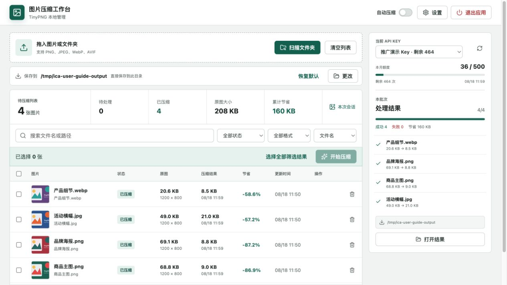
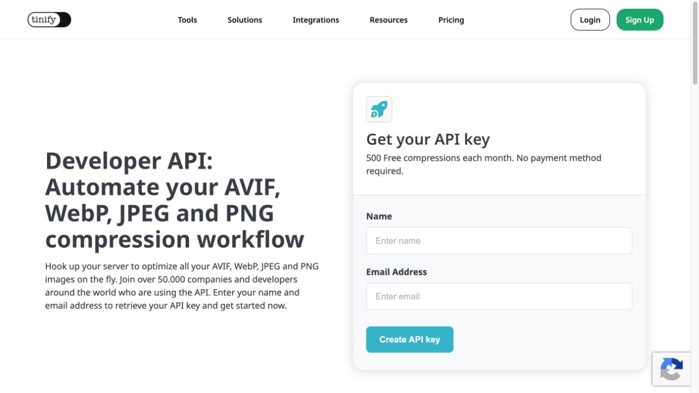
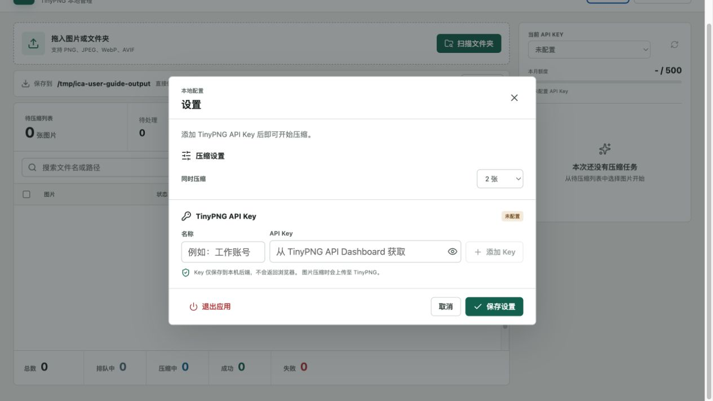
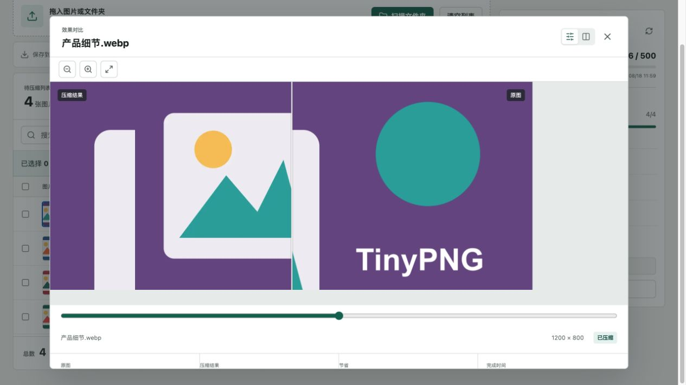

# 图片压缩工作台使用指南

> 文档版本：v1.0  
> 更新日期：2026-08-18  
> 适用平台：Apple Silicon macOS

图片压缩工作台是一款在 Mac 本机运行的 TinyPNG 批量图片压缩工具。它适合电商、设计、内容运营和开发团队集中处理商品图、活动图、网页素材等图片：把图片加入列表，选择保存位置，即可批量压缩并查看每张图片节省的空间。

## 1. 重点功能

| 功能 | 说明 |
| --- | --- |
| 批量导入 | 直接拖入图片，或扫描整个文件夹及其子文件夹 |
| 多格式支持 | 支持 PNG、JPEG/JPG、WebP 和 AVIF |
| 灵活整理 | 支持搜索、状态/格式筛选、排序、多选、移除和清空 |
| 自动压缩 | 开启后，新识别的图片会立即进入压缩队列 |
| 多 API Key | 可保存多个 TinyPNG API Key，分别查看额度并手动切换 |
| 安全保存 | 桌面版使用 macOS 安全存储加密 Key，页面不会取回完整 Key |
| 结果管理 | 自动处理重名文件，可打开结果目录并查看批次进度 |
| 效果对比 | 支持原图与压缩结果滑块对比、并排对比和缩放查看 |
| 失败可控 | 失败项不会自动重试，确认原因后可逐项重新压缩 |

## 2. 使用前准备

开始前请准备：

- 一台 Apple Silicon Mac（M1、M2、M3、M4 或更新芯片）。
- 可访问 TinyPNG/Tinify 服务的网络。
- 一个 TinyPNG Developer API Key。
- 允许上传给 TinyPNG 处理的图片。图片会离开本机并发送到 TinyPNG 服务。

## 3. 申请 TinyPNG API Key

### 3.1 打开官方申请页

访问 [TinyPNG Developer API 申请页](https://tinypng.com/developers)。填写姓名和邮箱，然后点击 **Create API key**。

> 注意：TinyPNG 当前的 API 请求域名是 `api.tinify.com`，它不是 Key 申请页面。请只在 TinyPNG/Tinify 官方网站申请和查看 Key，不要把 Key 提交给不明网站。

截至本文更新时，官方申请页标注每月提供 500 次免费压缩，且无需填写支付方式。免费额度和计费规则可能调整，请以 [TinyPNG API 价格页](https://tinypng.com/pricing/api) 和账户后台显示为准。

### 3.2 激活账户并复制 Key

1. 打开 TinyPNG/Tinify 发到注册邮箱的激活邮件。
2. 点击邮件中的激活按钮，进入 API Dashboard。
3. 在 [API Dashboard](https://tinify.com/dashboard/api) 找到 API Key。
4. 复制 Key，避免在聊天、截图或公开文档中泄露。

如果没有收到邮件，请先检查垃圾邮件，再确认申请时填写的邮箱是否正确。

## 4. 首次配置应用

1. 打开图片压缩工作台。
2. 点击右上角 **设置**。
3. 在“名称”中填写便于识别的名称，例如“工作账号”或“电商项目”。
4. 将刚复制的 Key 粘贴到“API Key”。
5. 点击 **添加 Key**。应用会连接 TinyPNG 验证 Key，并读取本月已用额度。
6. 根据需要把“同时压缩”设置为 1 至 5 张，然后点击 **保存设置**。

第一个成功添加的 Key 会自动成为当前 Key。后续可继续添加其他 Key，并通过主页面右侧的下拉框或设置页手动切换。

> 切换 Key 只影响切换后创建的新任务。已经排队或正在压缩的图片仍使用原来的 Key；应用不会自动轮换 Key。

## 5. 一般使用流程

### 第一步：加入图片

有两种方式：

- **拖入图片或文件夹**：把图片或文件夹直接拖到页面顶部区域。
- **扫描文件夹**：点击 **扫描文件夹**，选择一个目录；应用会递归扫描子文件夹。

扫描过程中会显示发现数量、处理数量和警告数量。需要提前结束时，可点击 **停止扫描**；已经识别的图片会继续保留。同一路径重复导入会自动去重。

### 第二步：整理待压缩列表

导入后，可在开始压缩前：

- 搜索文件名或路径。
- 按状态、格式筛选。
- 按文件名、大小、更新时间、压缩时间或节省比例排序。
- 勾选单张、当前页或全部筛选结果。
- 移除不需要处理的图片，或清空整个列表。

正在排队或压缩的图片不能从列表移除。

### 第三步：确认保存位置

主页面“保存到”一栏会显示当前结果目录：

- **默认位置**：本次打开应用后的第一个任务会在系统“下载”目录创建 `图片压缩_YYYY-MM-DD_HH-mm-ss` 文件夹；本次会话中的后续任务复用该文件夹。
- **自定义位置**：点击 **更改** 选择目录。结果会直接写入所选目录，不再创建时间子文件夹。
- **恢复默认**：点击 **恢复默认**，重新使用系统下载目录规则。

同名结果不会覆盖已有文件，应用会自动添加数字后缀。

### 第四步：开始压缩

确认勾选项后，点击 **开始压缩**。右侧“本批次”面板会显示总数、成功数、失败数、已节省空间和逐项进度。

也可以打开顶部 **自动压缩** 开关。开启后，随后拖入或扫描到的新图片会逐张创建任务，无需再次点击“开始压缩”。开关只影响之后识别的图片，不会取消已经排队的任务。

### 第五步：查看和使用结果

压缩完成后：

- 点击右侧 **打开结果**，在 Finder 中打开输出目录。
- 点击列表中的图片，打开原图与压缩结果预览。
- 使用顶部按钮切换滑块对比或并排对比。
- 使用缩放按钮检查细节，并查看原始大小、结果大小和节省比例。

## 6. API Key 与额度管理

- 主页面右侧显示当前 Key、本月已用次数和剩余次数。
- 点击刷新按钮可重新获取当前 Key 的额度。
- 设置页可添加、重命名、删除或切换多个 Key。
- 每个 Key 的额度独立显示。
- 当前 Key 额度不足时，可切换到另一个可用 Key，再对失败项点击 **重新压缩**。
- 删除当前 Key 前，如还有其他 Key，需要先切换到其他 Key。

TinyPNG 是否计入一次压缩，以其服务器和 Dashboard 记录为准。若上传已经发生后网络中断或强制退出，远端仍可能计入次数，因此应用不会自动重试不确定的请求。

## 7. 图片状态说明

| 状态 | 含义与建议 |
| --- | --- |
| 待压缩 | 已加入列表，尚未创建任务 |
| 排队中 | 已创建任务，等待可用并发位置 |
| 压缩中 | 正在上传、压缩或保存结果 |
| 已压缩 | 结果已成功保存，可打开预览 |
| 原图已更新 | 原图在压缩后发生变化，建议重新压缩 |
| 结果缺失 | 结果文件被移动或删除，建议重新压缩 |
| 压缩失败 | 查看错误信息，解决原因后手动重新压缩 |
| 不支持 | 文件格式或内容无法处理 |

## 8. 常见问题

### 添加 Key 时提示无效或无法连接

确认复制的是 API Dashboard 中的完整 Key，前后没有多余空格；再检查网络是否可以访问 TinyPNG/Tinify。不要使用网页账号密码代替 API Key。

### 提示本月额度已用尽

在右侧额度面板刷新数据。如确已用尽，可等待额度周期更新，或切换到另一个可用 Key，再手动重新压缩失败项。应用不会自动切换 Key 或自动续跑。

### 找不到压缩后的图片

查看主页面“保存到”路径，或点击右侧 **打开结果**。使用默认位置时，结果位于“下载/图片压缩_时间”目录；使用自定义位置时，结果直接位于所选目录。

### 某张图片压缩失败怎么办

先阅读该项的错误信息并处理网络、Key 或额度问题，然后点击 **重新压缩**。失败不会影响本批次中已经成功的图片。

### 关闭应用后列表和任务不见了

这是当前版本的设计：待压缩列表和批次只属于本次应用会话。关闭应用会中断未完成任务；重新打开后不会恢复列表、历史批次或未完成任务。已成功写入输出目录的文件不会被删除。

### 原图会被修改吗

不会。应用只读取原图，压缩结果写入单独的输出目录。保存结果时会先写临时文件并校验，再移动到最终位置。

## 9. 隐私与使用建议

- API Key 保存在本机。桌面版使用 macOS 安全存储加密，完整 Key 不会返回页面，也不应出现在数据库或日志中。
- 图片压缩依赖 TinyPNG 服务，所选图片会上传到第三方。处理客户资料、未发布设计或其他敏感图片前，请先确认组织的数据合规要求。
- 大批量任务建议先用少量图片验证保存位置和效果，再导入全部素材。
- 网络不稳定时可将“同时压缩”调低，减少并发请求。
- 压缩进行中请保持应用打开；退出会取消排队任务并中断正在进行的请求。
